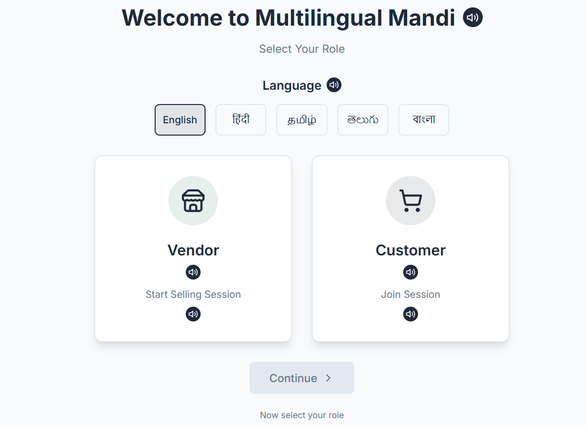
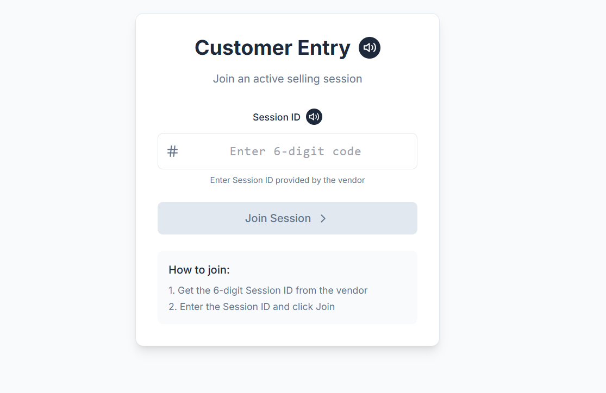

# 🛒 Multilingual Mandi - AI-Powered Marketplace Platform

A sophisticated real-time negotiation platform for local trade with AI-powered pricing, multilingual support (5 languages), and cultural adaptation for Indian markets. Designed to reduce language barriers and negotiation friction in Indian local markets using AI.


<p align="center">
  
</p>

## Demonstration
<p align="center">
  
</p>

<p align="center">
  
</p>


## 🌟 Key Features

### 🤖 AI-Powered Core (Gemini 2.5 Flash Exclusive)

- **AI Pricing Engine** : Used to replace static or vendor-biased pricing with real-time, location-aware market prices that adapt to seasonality and demand.

- **AI Cultural Translation Engine** : Used to go beyond literal translation by converting messages into polite, indirect, culturally appropriate marketplace language across Indian languages.

- **AI Negotiation Agent** : Used to automate bargaining by generating context-aware counter-offers while protecting vendor floor prices and maintaining respectful negotiation flow.

### 🌍 Multilingual Support (5 Languages)
- **Languages**: English, Hindi (हिन्दी), Tamil (தமிழ்), Telugu (తెలుగు), Bengali (বাংলা)
- **Voice Integration**: Speech-to-text and text-to-speech with ResponsiveVoice
- **Cultural Adaptation**: Polite, indirect communication for Indian markets
- **Real-time Translation**: Live message transformation between languages
- **1313+ Translation Keys**: Comprehensive localization coverage

### 💬 Real-Time Communication
- **Socket.IO Integration**: Live bidirectional communication
- **Session Management**: 6-digit session IDs for vendor-customer pairing
- **Custom Message Bridge**: Voice + text with cultural context
- **Live Cart Sync**: Real-time cart updates between vendor and customer
- **Instant Notifications**: Toast alerts with sound feedback

### 🏪 Advanced Marketplace Features
- **Vendor Dashboard**: AI-powered inventory management with live pricing
- **Customer Shopping**: Browse products with real-time price updates
- **Smart Negotiation**: AI-mediated price negotiations (max 3 rounds)
- **Floor Price Protection**: Vendor minimum price enforcement
- **Stock Validation**: Prevents overselling with real-time stock checks
- **Payment Integration**: UPI (Razorpay) + Cash payment options


## 🏗️ Architecture

### Technology Stack
- **Frontend**: React 18, Socket.IO Client, Tailwind CSS, i18next
- **Backend**: Node.js, Express, Socket.IO Server
- **AI Engine**: Google Gemini 2.5 Flash (exclusively, no fallbacks)
- **Payment**: Razorpay integration
- **Voice**: ResponsiveVoice TTS + Web Speech API
- **Real-time**: WebSocket connections for live updates

### System Architecture
```
┌─────────────────┐    ┌─────────────────┐    ┌─────────────────┐
│   Frontend      │    │   Backend       │    │   AI Services   │
│   (React)       │◄──►│   (Express)     │◄──►│   (Gemini 2.5)  │
│                 │    │                 │    │                 │
│ • Vendor UI     │    │ • REST APIs     │    │ • Price-Gen     │
│ • Customer UI   │    │ • Socket.IO     │    │ • Translation   │
│ • Voice/Text    │    │ • Session Mgmt  │    │ • Negotiation   │
│ • 5 Languages   │    │ • Payment       │    │ • Polite-Conv   │
└─────────────────┘    └─────────────────┘    └─────────────────┘
```

## 🚀 Quick Start

### Prerequisites
- Node.js 16+
- Multiple Gemini API keys (dedicated keys recommended)
- Razorpay account (optional, for UPI payments)

### Installation
```bash
# Clone repository
git clone <repository-url>
cd multilingual-mandi

# Install all dependencies
npm run install-all

# Setup environment variables
cp .env.example .env
# Edit .env with your API keys

# Start development servers
npm run dev
```

### Environment Setup
```env
# Dedicated Gemini API Keys (recommended)
GEMINI_PRICES_KEY=your_dedicated_pricing_key
GEMINI_TRANSLATE_KEY=your_dedicated_translation_key
GEMINI_POLITE_KEY=your_dedicated_polite_conversion_key
GEMINI_NEGOTIATION_KEY=your_dedicated_negotiation_key

# Razorpay (optional)
RAZORPAY_KEY_ID=rzp_test_your_key_id
RAZORPAY_KEY_SECRET=your_razorpay_secret
```

## 📱 User Flows

### Vendor Journey
1. **Role Selection**: Choose "Vendor" and select language
2. **Category Setup**: Select product categories (vegetables/fruits)
3. **Inventory Management**: AI generates products with live market prices
4. **Price Configuration**: Set vendor prices and floor prices (minimum acceptable)
5. **Session Creation**: Generate unique 6-digit session ID
6. **Dashboard Management**: Handle negotiations, cart updates, and payments

### Customer Journey
1. **Role Selection**: Choose "Customer" and select language
2. **Session Entry**: Enter 6-digit session ID from vendor
3. **Product Browsing**: View live inventory with real-time prices
4. **Cart Management**: Add products with stock validation
5. **Price Negotiation**: AI-mediated bargaining with cultural sensitivity
6. **Payment**: Complete purchase via UPI or Cash

## 🤖 AI Services Architecture

### Dedicated API Keys System
```javascript
// Service-specific API keys for better quota management
GEMINI_PRICES_KEY      // Price generation and market analysis
GEMINI_TRANSLATE_KEY   // Multilingual translation
GEMINI_POLITE_KEY      // Polite speech conversion
GEMINI_NEGOTIATION_KEY // Negotiation agent responses
```

### AI Service Features
- **Fallbacks**: Pure AI system - fails gracefully if AI unavailable
- **Batch Processing**: Efficient price generation for multiple products
- **Cultural Context**: Indian marketplace communication patterns
- **Error Handling**: Comprehensive retry logic with API key rotation

## 🌍 Language Support

### Supported Languages
| Language | Code | Script | Voice Support | Status |
|----------|------|--------|---------------|---------|
| English | en | Latin | ✅ UK English Male | Primary |
| Hindi | hi | Devanagari | ✅ Hindi Male | Full |
| Tamil | ta | Tamil | ✅ Tamil Male | Full |
| Telugu | te | Telugu | ✅ Telugu Male | Full |
| Bengali | bn | Bengali | ✅ Bengali Male | Full |

### Cultural Adaptation Features
- **Indirect Speech**: "The customer is inquiring if..." vs "I want..."
- **Respectful Bargaining**: Polite negotiation maintaining dignity
- **Market Terminology**: Region-specific terms for products and pricing
- **Relationship Building**: Focus on long-term vendor-customer relationships

## 💰 Payment Integration

### Supported Payment Methods
- **UPI**: Razorpay integration with real-time verification
- **Cash**: Vendor confirmation workflow with notifications
- **Transaction Tracking**: Unique transaction IDs for all payments

### Payment Flow
1. Customer selects payment method
2. For UPI: Razorpay order creation → Payment → Verification
3. For Cash: Vendor notification → Manual confirmation
4. Stock reduction on successful payment
5. Sale completion notifications

## 🔄 Real-Time Features

### Socket.IO Events
- **Session Management**: Create/join sessions with 6-digit IDs
- **Inventory Updates**: Live product and price synchronization
- **Cart Synchronization**: Real-time cart updates between users
- **Negotiation Events**: AI-mediated price negotiations
- **Payment Notifications**: Real-time payment status updates
- **Custom Messaging**: Multilingual message exchange

## 🛠️ Development

### Available Scripts
```bash
npm run dev          # Start both server and client
npm run server       # Start backend only
npm run client       # Start frontend only
npm run build        # Build for production
npm run debug-ai     # Test AI services
npm run test-api     # Test API endpoints
```

### Testing AI Services
```bash
# Test price generation
npm run debug-ai

# Test API endpoints
npm run test-api

# Health check
curl http://localhost:5000/api/health
```

## 📊 Project Statistics

- **Total Files**: 50+ components and services
- **Translation Keys**: 1313+ comprehensive localization
- **Languages Supported**: 5 (English, Hindi, Tamil, Telugu, Bengali)
- **AI Services**: 4 dedicated services with separate API keys
- **Socket Events**: 25+ real-time event types
- **API Endpoints**: 10+ REST endpoints
- **Product Categories**: 2 (vegetables, fruits) with 5 products each

## 🔧 Configuration

### AI Model Configuration
```javascript
// Gemini 2.5 Flash settings
{
  pricing: { temperature: 0.3, maxTokens: 20 },
  translation: { temperature: 0.7, maxTokens: 200 },
  negotiation: { temperature: 0.8, maxTokens: 150 },
  polite: { temperature: 0.8, maxTokens: 1000 }
}
```

### Session Management
- **Session IDs**: 6-digit alphanumeric codes
- **Storage**: In-memory (no database required)
- **Cleanup**: Automatic cleanup on disconnection
- **Isolation**: Complete session isolation between vendor-customer pairs

## 🚀 Deployment

### Production Build
```bash
npm run build        # Build React app
npm start           # Start production server
```

### Environment Variables (Production)
```env
NODE_ENV=production
PORT=5000
CLIENT_URL=https://your-domain.com
# ... API keys
```

## 📈 Monitoring & Analytics

### Key Metrics
- AI service success rates
- Translation accuracy
- Negotiation completion rates
- Payment success rates
- User satisfaction scores

### Logging
- AI response logging
- API error tracking
- Session event monitoring
- Performance metrics

## 🤝 Contributing

1. Fork the repository
2. Create feature branch (`git checkout -b feature/amazing-feature`)
3. Commit changes (`git commit -m 'Add amazing feature'`)
4. Push to branch (`git push origin feature/amazing-feature`)
5. Open Pull Request

## 👤 Author

**Krishnapriya K.**  
🎓 Computer Science Graduate  

🔗 LinkedIn: https://www.linkedin.com/in/krishnapriya-k-68a7b5254/  
💻 GitHub: https://github.com/krish2213


## 🙏 Acknowledgments

- Google Gemini 2.5 Flash for AI capabilities
- Socket.IO for real-time communication
- Razorpay for payment processing
- ResponsiveVoice for multilingual TTS
- React and Node.js communities

---

**Built with ❤️ for Indian local trade communities**

