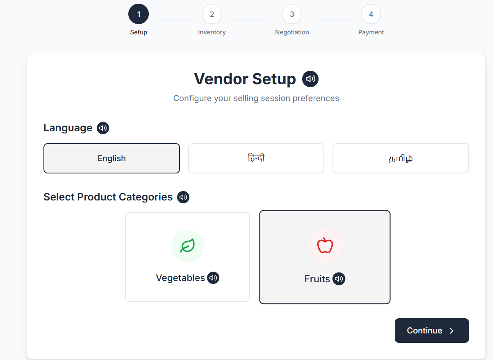
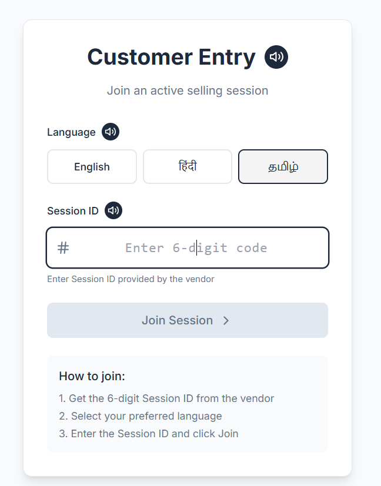

# 🛒 Multilingual Mandi - AI-Powered Marketplace Platform

A sophisticated real-time negotiation platform for local trade with AI-powered pricing, multilingual support, and cultural adaptation for Indian markets.

## 🌟 Features

### 🤖 AI-Powered Core (Gemini 2.5 Flash)
- **Live Price Generation**: Real-time market prices using AI analysis
- **Smart Product Discovery**: AI-generated product catalogs for vegetables and fruits
- **Intelligent Negotiation**: Multi-round AI negotiation agent with floor price management
- **Cultural Translation**: Context-aware translation with indirect speech patterns
- **Market Trend Analysis**: AI-driven price trend predictions

### 🌍 Multilingual Support
- **Languages**: English, Hindi, Tamil
- **Voice Integration**: Speech-to-text and text-to-speech
- **Cultural Adaptation**: Polite, indirect communication for Indian markets
- **Real-time Translation**: Live message transformation between languages

### 💬 Real-Time Communication
- **Socket.IO Integration**: Live bidirectional communication
- **Custom Message Bridge**: Voice + text with cultural context
- **Toast Notifications**: Real-time alerts with sound
- **Session Management**: Secure vendor-customer pairing

### 🏪 Marketplace Features
- **Vendor Dashboard**: Inventory management with AI pricing
- **Customer Shopping**: Browse products with live prices
- **Smart Negotiation**: AI-mediated price negotiations
- **Floor Price Protection**: Vendor minimum price enforcement
- **Real-time Cart Sync**: Live cart updates between users

## 📸 Application Screenshots

### Vendor Dashboard

*AI-powered inventory management with live pricing and multilingual support*

### Customer Shopping Interface

*Real-time product browsing with cultural translation and voice integration*

## 🚀 Quick Start

### Prerequisites
- Node.js 16+ and npm
- Gemini API keys (get from [Google AI Studio](https://makersuite.google.com/app/apikey))

### Installation

1. **Clone and Install**
   ```bash
   git clone <repository-url>
   cd multilingual-mandi
   npm run install-all
   ```

2. **Environment Setup**
   ```bash
   cp .env.example .env
   # Edit .env with your Gemini API keys
   ```

3. **Start Development**
   ```bash
   npm run dev
   ```

4. **Test AI Services**
   ```bash
   npm run debug-ai
   npm run test-api
   ```

## 🔧 Configuration

### Environment Variables (.env)
```env
# Gemini API Keys (Multiple for quota management)
GEMINI_API_KEY_1=your_first_gemini_api_key
GEMINI_API_KEY_2=your_second_gemini_api_key
GEMINI_API_KEY_3=your_third_gemini_api_key

# Server Configuration
PORT=5000
NODE_ENV=development
CLIENT_URL=http://localhost:3000
DEFAULT_LOCATION=Mumbai
```

### API Key Setup
1. Visit [Google AI Studio](https://makersuite.google.com/app/apikey)
2. Create multiple API keys for quota distribution
3. Add keys to `.env` file
4. Test with `npm run debug-ai`

## 🏗️ Architecture

### Backend Services
```
server/
├── index.js                 # Express server + Socket.IO
├── services/
│   ├── aiPriceService.js    # AI-powered pricing (Gemini 2.5 Flash)
│   ├── messageTransformService.js # Multilingual translation
│   └── negotiationAgent.js  # Smart negotiation logic
```

### Frontend Components
```
client/src/
├── components/
│   ├── common/              # Shared components
│   ├── customer/            # Customer-specific UI
│   └── vendor/              # Vendor-specific UI
├── contexts/
│   └── SocketContext.js     # Real-time communication
└── i18n/                    # Internationalization
```

## 🤖 AI Services

### Price Generation
- **Model**: Gemini 2.5 Flash
- **Features**: Live market analysis, seasonal factors, location-based pricing
- **Fallback**: None (AI-only system)

### Translation Service
- **Model**: Gemini 2.5 Flash
- **Features**: Cultural adaptation, indirect speech, context preservation
- **Languages**: English ↔ Hindi ↔ Tamil

### Negotiation Agent
- **Model**: Gemini 2.5 Flash
- **Features**: Multi-round negotiation, floor price protection, polite counter-offers
- **Logic**: Round-based escalation with final offer mechanism

## 📱 User Flows

### Vendor Flow
1. **Setup**: Select categories (vegetables/fruits)
2. **Inventory**: AI generates products with live prices
3. **Pricing**: Set vendor prices and floor prices
4. **Session**: Create session and share ID
5. **Negotiation**: Handle customer negotiations with AI assistance

### Customer Flow
1. **Join**: Enter session ID and select language
2. **Browse**: View products with live AI pricing
3. **Cart**: Add items with real-time sync
4. **Negotiate**: AI-mediated price negotiations
5. **Communication**: Voice/text with cultural translation

## 🛠️ Development

### Available Scripts
```bash
npm run dev          # Start both server and client
npm run server       # Start backend only
npm run client       # Start frontend only
npm run debug-ai     # Test AI services
npm run test-api     # Test API endpoints
npm run build        # Build for production
```

### Testing AI Services
```bash
# Debug AI initialization and API keys
npm run debug-ai

# Test all API endpoints
npm run test-api

# Check server health
curl http://localhost:5000/api/health
```

## 🌐 API Endpoints

### Core APIs
- `GET /api/test` - Basic connectivity test
- `GET /api/health` - AI services health check
- `GET /api/products/:category` - AI-generated products with live pricing
- `POST /api/transform-message` - Multilingual message translation
- `GET /api/languages` - Supported languages

### Real-time Events (Socket.IO)
- `create-session` - Vendor creates trading session
- `join-session` - Customer joins session
- `update-inventory` - Live inventory updates
- `propose-price` - Negotiation events
- `send-custom-message` - Multilingual messaging

## 🔒 Security & Privacy

- **API Key Rotation**: Multiple keys for quota management
- **Session Isolation**: Secure vendor-customer pairing
- **Input Validation**: Sanitized user inputs
- **CORS Protection**: Configured for development/production
- **No Data Persistence**: Sessions are memory-based

## 🌍 Localization

### Supported Languages
- **English**: Primary interface language
- **Hindi**: हिन्दी - Full translation support
- **Tamil**: தமிழ் - Full translation support

### Cultural Adaptation
- Indirect speech patterns for polite communication
- Market-appropriate terminology
- Regional price variations
- Cultural context preservation

## 🚀 Deployment

### Production Build
```bash
npm run build
npm start
```

### Environment Variables (Production)
```env
NODE_ENV=production
CLIENT_URL=https://your-domain.com
# Add production Gemini API keys
```

## 🤝 Contributing

1. Fork the repository
2. Create feature branch (`git checkout -b feature/amazing-feature`)
3. Commit changes (`git commit -m 'Add amazing feature'`)
4. Push to branch (`git push origin feature/amazing-feature`)
5. Open Pull Request

## 📄 License

This project is licensed under the MIT License - see the [LICENSE](LICENSE) file for details.

## 🙏 Acknowledgments

- **Google Gemini AI** for powerful language models
- **Socket.IO** for real-time communication
- **React** and **Express** for robust frameworks
- **Indian Market Research** for cultural insights

## 📞 Support

For support and questions:
- Create an issue in the repository
- Check the [API documentation](#-api-endpoints)
- Run diagnostic tools (`npm run debug-ai`)

---

**Built with ❤️ for Indian local markets** 🇮🇳